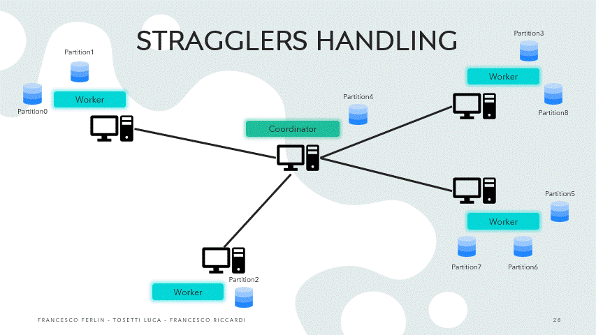
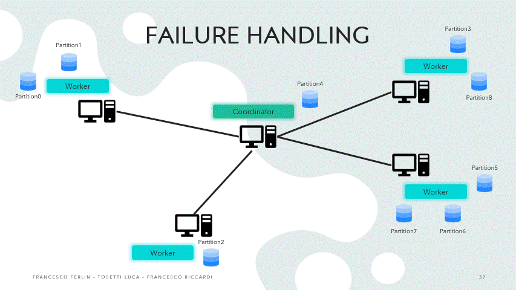

# Fault-tolerant dataflow platform

\[Optional\] project for the "Distributed Systems" course at Politecnico di Milano, academic year 2023/2024

Grade: 4/4

It's an implementation of a distributed dataflow platform for processing large amount (big-data) of
key-value pairs.

The complete spec can be found [here](Progetti.pdf), our implementation lifts a couple of restrictions
compared to it.

The platform is capable of running JavaScript programs consuming tuples, where keys and values can be
of any type. A program is composed of a combination of the following operators:

- map(f: (k: K, v: V) => V1): for each input tuple <k, v>, it outputs a tuple <k, f(v)>
- filter(f: (k: K, v: V) => boolean): for each input tuple <k, v>, it outputs the same tuple <k, v> if
  f(v) is true, otherwise it drops the tuple
- changeKey(f: (k: K, v: V) => K1): for each input tuple <k, v>, it outputs zero, one or multiple tuples
  in a Map
- flatMap(f: (k: K, v: V) => Map<K1, V1>): for each input tuple <k, v>, it outputs a tuple <f(v), v>
- reduce(f: (k: K, vls: [V]) => V1): takes in input the list V of all values for key k, and outputs a
  single tuple <k, f(V)>
  The reduce operator, if present in a program, does not have to be the last one (contrary to the original spec).

An example word count program is the following:

```js
engine
  .lines({ file: "kinglear.txt", partitions: 8 })
  .flatMap(function (line, _) {
    let words = /** @type {Map<string, number>} */ new Map();
    line.split(/(\s+)/).forEach(function (word) {
      word = word.trim();
      if (word.length !== 0) words.set(word, (words.get(word) || 0) + 1);
    });
    return words;
  })
  .changeKey((word, _) => word.toLowerCase())
  .reduce(function (word, counts) {
    return counts.reduce((a, b) => a + b, 0);
  });
```

The platform includes a coordinator and multiple workers running on multiple nodes of a
distributed system. All nodes are connected to a "Distributed File System" (which in reality
is not a real one, it's a bunch of Postgres databases all connected to each other, communicating
between them using [FDW](https://www.postgresql.org/docs/current/postgres-fdw.html)).

The coordinator accepts dataflow programs specified as above, where input data can be read line by
line from a text file, or already stored in tuple form on the DFS. Each operator is executed in parallel
over multiplepartitions of the input data, where the number of partitions is specified either:

- as part of the dataflow program if the input is not already partitioned (such as in a text file)
- as an already existing number of partitions on the DFS
  The coordinator assigns individual tasks to workers and guides the computation, using a scheduled
  batching approach.


The application also implements the following fault-tolerance mechanisms that limit the amount of work
that needs to be re-executed in the case a worker fails:

- In case a worker fails and completely disconnects from the coordinator, another worker is choosen to
  complete the task in its stead
  
- In case a worker is a straggler (which means it does not fail, but takes way too long to complete
  compared to others), another worker is choosen and the two race to finish first
  
- In case a worker recovers from a crash, it will be instructed to load intermediate results from
  the its DFS node (which is considered durable, somewhat local storage) and resume back from where
  it was before
  

In case all the above fails and the coordinator has no connected workers for a given threshold, all
is lost


It is assumed the coordinator to be reliable.

Programs can additionally be parameterized and re-used. For example, the following page-rank program
takes a bunch of parameters as input:

```js
// https://github.com/apache/flink/blob/9cc5ab9caf368ef336599e7d48f679c8c9750f49/flink-examples/flink-examples-batch/src/main/java/org/apache/flink/examples/java/graph/PageRank.java
const numOfPages = engineVars.number("numOfPages");
const iterations = engineVars.number("iterations");
const dampeningFactor = engineVars.number("dampeningFactor");

engine
  // Requires a { page: string, adjacencyList: string[] } as input tuples
  .requireInput((e) => /** @type {typeof Engine<string, string[]>} */ e)
  // Assign initial rank to pages
  .map((page, neighbors) => {
    return { rank: Number(1.0 / numOfPages), neighbors: neighbors };
  })
  .iterate(iterations, (engine) =>
    engine
      // Distribute a fraction of a vertex's rank to all neighbors
      .flatMap((page, val) => {
        const rankToDistribute = val.rank / val.neighbors.length;
        const newPages =
          /** @type {Map<string, { rank: number, neighbors: string[]? }>} */ new Map();
        // Distribute a fraction of a vertex's rank to all neighbors
        val.neighbors.forEach((neighbor) => {
          const curr = newPages.get(neighbor) || { rank: 0 };
          curr.rank += rankToDistribute;
          newPages.set(neighbor, curr);
        });
        // Also add the current page with 0 rank so that we can keep the neighbors list
        const curr = newPages.get(page) || { rank: 0 };
        curr.neighbors = val.neighbors;
        newPages.set(page, curr);

        return newPages;
      })
      // Collect and sum ranks & restore neighbors adjacency list
      .reduce((page, ranks) =>
        ranks.reduce((aVal, bVal) => {
          return {
            rank: aVal.rank + bVal.rank,
            neighbors: aVal.neighbors || bVal.neighbors,
          };
        })
      )
      // Apply the page rank dampening formula &
      .map((page, val) => {
        const randomJump = (1 - dampeningFactor) / numOfPages;
        return {
          rank: Number(val.rank * dampeningFactor + randomJump),
          neighbors: /** @type string[] */ (val.neighbors || []),
        };
      })
  )
  // Extract only page&rank
  .map((page, val) => val.rank);
```

and can then invoked from a separate program, which load tuples and specifies its parameters:

```js
engine
    .setup(engine => {
        return engine
            .declareVar("numOfPages", 15)
            .declareVar("iterations", 10)
            .declareVar("dampeningFactor", 0.85)
    })
    .exec(() => {
        const fileName = "page-rank-from-lines.js";

        engine
            .lines({ file: "links.txt", 8, "page-rank", "ranked-pages" })
            // Links are represented as pairs of page IDs which are separated by space characters. Links
            // are separated by new-line characters.<br>
            // For example <code>"1 2\n2 12\n1 12\n42 63"</code> gives four (directed) links (1)->(2),
            // (2)->(12), (1)->(12), and (42)->(63).
            .flatMap((line) => {
                let links = /** @type {Map<string, string[]>} */ new Map();
                line.split("\n").forEach(link => {
                    let src = link.split(" ")[0];
                    let dst = link.split(" ")[1];

                    links.set(src, (() => {
                        let curr = links.get(src) || /** @type string[] */ [];
                        curr.push(dst);
                        return curr
                    })());
                })
                return links
            })
            // A reduce function that takes a sequence of edges and builds
            // the adjacency list for the vertex where the edges originate.
            .reduce((src, dsts) => dsts.reduce((a, b) => a.concat(b)))
            .run('page-rank.js');
    })
```

For academic purposes, workers can also simulate crashes by using
`throw simulateCrash();` randomly at some point of the execution:

```js
engine
  // ... operators here
  .map(function (key, value) {
    if (Math.random() < 1 / 3000) throw simulateCrash();
    return value;
  });
```

Typescript files to ease the writing of programs can be found
[here](coordinator/src/test/resources/it/polimi/ds/dataflow/src/types.d.ts).

## Running

The program requires exactly Java 21, with preview features enabled (--enable-preview JVM flag),
because of the use of string templates which were removed in later versions.

The used DB version is Postgres 15.6. Later versions are probably fine, but could maybe cause
performance issues because of changes to FDW. Earlier versions are probably not fine but I am not
sure.

The gradle build can build ready to be used docker images using jib: `gradle jibDockerBuild`
builds two images `our-dataflow-coordinator` and `our-dataflow-worker`. However, DB and env
variables still need to be setup. See the [demo scripts](demo-scripts) to scavenge for more details.
